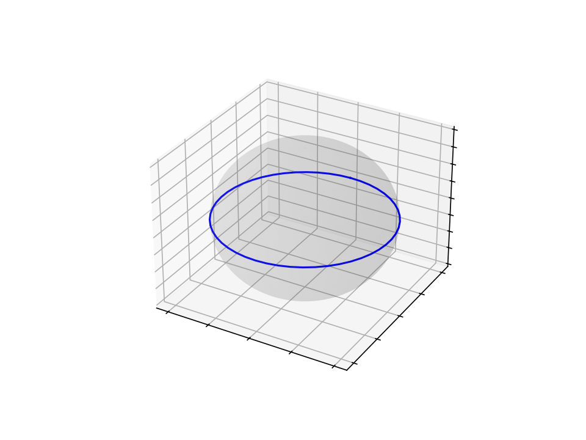

SPaCE
=====

Spin Precession and Coherent Echo (SPaCE) is a Python package to simulate
spectral parameters for a spin population perturbed by a pulse.

* ``SPaCE.py`` is the simulation program.
* ``SPaCE-examples.ipynb`` demonstrates the capabilities of the program.
* The gif files are generated by the examples file.

Using the 

The program can plot pulse sequences, net magnetization over time, and gifs of
the Block diagram of a spin/collection of spins over time!

Installation
------------

To install, first clone the git repo, then from the program folder, build and install the package.

.. code:: bash

    git clone https://github.com/zhasanbasri-hash/SPaCE.git
    cd SPaCE
    pip3 install build
    python -m build .
    pip3 install .
    # or, to install with the ability to edit the package and build documentation:
    pip3 install -e '.[doc]'

The package will now be installed in your current python environment or virtual
environment, and can be imported from any directory, the same as any other
package installed by ``pip``.

Documentation
-------------

The documentation is built using Sphinx. To build the documentation:

.. code:: bash

    cd doc
    # intialize a venv if you want to use one
    sphinx-build -b html ./source ./build

The html version of the documentation can now be found in `doc/build`.
