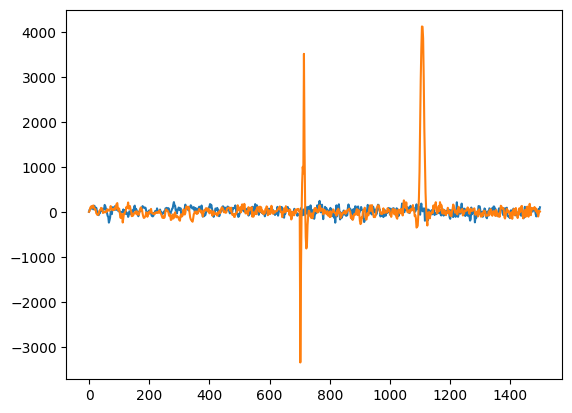

Tutorial for SPaCE
==================

Setting up and calculating an experimental trajectory
-----------------------------------------------------

First, make a spin system with 50,000 spins, evenly spread across a 1 GHz
bandwidth, centered at 0 GHz. Increasing the number of spins will make it
less 'noisy', but each step will take longer to calculate.

.. code:: python

    system=sp.spin(50000,method='Uniform',width=1) 

Next, we define the domain of the simulation. Below, we define a experiment
which is 1000 ns long, and we calculate the state of the spin system ``system``
every 2 ns, giving us 500 timepoints.

.. code:: python

    exp=sp.trajectory(1000,2,system)

Then, we define our pulse sequence. We first make a pulse object called ``p90``,
which we define as a 30 ns rectangular pulse with a pulse angle of :math:`\pi/2`.
We then generate a 60 ns rectangular :math:`\pi` pulse.

.. code:: python

    p90=sp.pulse(np.pi/2,30,'rect')
    p180=sp.pulse(np.pi,60,'rect')

We now have an experiment which incorporates the spin system, and several pulses.
We need to apply these pulses to the experiment.

* From t=1 to t=30 ns, we apply a :math:`\pi/2` pulse on +x at time 0.
* From t=30 to t=300 ns, we allow the system to precess for 300 ns.
* From t=330 to t=390 ns, we apply the $pi$ pulse along +x
* From t=390 to t=1000 ns, we allow the system to precess again.
* Finally, we calculate the signal (echo) intensity based on the transition,
  and net magnetization for the experiment. There is only one transition for
  :math:`S=1/2` systems, but we still need to calculate the intensity of it.

.. code:: python 

    trj.flip(p90,0,'+x')
    trj.precess(30,330)
    trj.flip(p180,330,'+x')
    trj.precess(390,1000)
    trj.calc_intensity()
    trj.net_M()

Visualizing the experiment
--------------------------

Now, we can plot the results of our experiment, in terms of the net
magnetization of the spins along the X and Y axes:

.. code:: python

    plt.plot(trj.time,trj.M[0],label='Real (X magnitude)')
    plt.plot(trj.time,trj.M[1],label='Imag (Y magnitude)')
    plt.legend()
    plt.xlabel('Time (ns)')
    plt.ylabel('Arb Intensity')

We can display the pulse sequence on the same axis, by redefining the pulses
in the trajectory as a pulse sequence, and setting display parameters.

.. code:: python

    trj.p_seq([p90,p180],[0,330],['+x','+x'],norm_y=3000000,norm_x=1)
    trj.seq[:,0]=np.array([0,0,0])
    plt.plot(trj.time,trj.seq[0],label='Pulse sequence')
    plt.plot(trj.time,trj.seq[1],label='Y magnetization')
    plt.legend()
    plt.xlabel('Time (ns)')
    plt.ylabel('Arb Intensity')

Or, we can visualize it on the bloch diagram. This will display the
transformation over the time period 0-32 ns of the simulated spin closest
to a frequency of 0 GHz, the center of the band. It will output the file
test_central_spin.gif to the current working directory, with frames which are
each displayed for 200 ms. See documentation for the ``display_bloch``
function for more info.

.. code:: python

    trj.display_bloch(0,32,0,'test_central_spin.gif',interval=200)

You can also select a set of spins to display on the bloch sphere. This will
select the spins closest to 0, 0.005, and 0.01 GHz.

.. code:: python

    trj.display_bloch(0,32,[0,0.005,0.01],'test_mult_spins.gif',interval=200)

.. image:: _static/test_mult_spins.gif

For an interactive plot, `plotlib` can be set to `pl` or `plotly`. In
order to use it in a notebook, the following lines should be included in the
import block:

.. code:: python

    import plotly
    pl.offline.init_notebook_mode()

Then, the bloch sphere can be displayed in plotly with the following line.
The plot is displayed in an HTML canvas within the notebook. Pressing the
play button will animate it. There is unfortunately no animation exporting
built into Plotly, so that is not implemented.

.. code:: python

    trj.display_bloch(0,32,[0,0.005,0.01, 0.015],plotlib='pl',size=[6,6])

We can also select a single spin, and plot it. We first extract the trajectory
of the spin closest to $\nu=0$, then plot all three of its dimensions along
the XY plane.

.. code:: python

    central_traj=trj.get_traj(0)
    plt.plot(trj.time,central_traj[0],label='X')
    plt.plot(trj.time,central_traj[1],label='Y')
    plt.plot(trj.time,central_traj[2],label='Z')
    plt.legend()

We can also visualize the pulse bandwidth, or how spins across the bandwidth
flip. We first sort the spins by frequency (they are initially a random set),
then plot the trajectory. Note that the index of ``trj.traj`` has the dimensions
of [number of spins, XYZ dimension, time point], so we are plotting the
trajectory along the z axis (``2``), at timepoint ``16`` (i.e. 32 ns), and
pulling the data points in order of frequency. We can see that by 32 ns, the
spins at $\nu=0$ are flipped away from Z.

.. code:: python

    order=np.argsort(trj.nu)#Sort the spins based off of frequency
    plt.plot(trj.nu[order],trj.traj[order,2,16], label='M[Z], 32 ns')
    plt.plot(trj.nu[order],trj.traj[order,2,0], label='M[Z], 0 ns')
    plt.legend(loc='lower right')
    plt.show()

Customizing the experiment
--------------------------

To investigate a specific frequency of spin more quickly, we can use a sparse
set of spins (here, 2) and manually set their frequencies:

.. code:: python

    test2=sp.spin(2)
    test2.nu=np.array([0,0.05])

Or, we can manually make a specific spectral shape, by loading a spin distribution
from a binary NumPy file. This structure should be an array of the form
[frequency,intensity] where the frequency should be a list centered at the
center of the bandwidth, and the second is the intensity forming the shape of the
spectrum.

Then, load the lineshape into a spin system using the dist_file argument and
the ``histogram`` argument, to approximate the curve as a collection of bins
of spins.

.. code:: python

    #load a spectrum in field vs. intensity
    dist=np.load('Sim_NO.npy')
    #super rough calculation of converting field to frequency
    dist[0]=(dist[0]*2.8-9800)/1000*-1 
    f,axs = plt.subplots(1,2, figsize=[9,4])
    axs[0].plot(dist[0],dist[1]) #Visualize your data input
    test3=sp.spin(50000,method='Histogram',dist_file=dist)
    #Visualize your spin system with histograms
    axs[1].hist(test3.nu,bins=100)
    plt.show()

Complex Pulse Sequences
-----------------------

We can implement a three-pulse ESEEM (no phase cycling) can be
implement as shown below.

.. code:: python

    test4=sp.spin(50000)
    trj_eseem=sp.trajectory(1500,2,test4)

    p90=sp.pulse()
    p90.rect(np.pi/2,12)

    trj_eseem.flip(p90,0,'+x')
    trj_eseem.precess(12,400)
    trj_eseem.flip(p90,400,'+x')
    trj_eseem.precess(412,700)
    trj_eseem.flip(p90,700,'+x')
    trj_eseem.precess(712,1500)
    trj_eseem.calc_intensity()
    trj_eseem.net_M()

    plt.plot(trj_eseem.time,trj_eseem.M[0],label='X')
    plt.plot(trj_eseem.time,trj_eseem.M[1],label='Y')

Note that except for the 2-pulse hahn echo, ENDOR, and EDNMR,
phase cycling is almost a requirement to identify which echo
is the correct one, unless you already know. Phase cycling can
be implemented via a for loop, as shown below for a 2-mode
cycle for pulse 3:

.. code:: python

    # 2-step phase cycle
    p3_phases=['+x','-x'] #list of phases of pulse 3
    sum_coeff=[1,-1]

    # Make array for summing phase cycles
    # 3 dimensions with 750 time points in a 1500 length and
    # 2 ns increments
    signal=np.zeros((3,750)) 

    for i,j in enumerate(p3_phases):
        test4=sp.spin(50000)
        trj_eseem=sp.trajectory(1500,2,test4)

        p90=sp.pulse()
        p90.rect(np.pi/2,12)

        trj_eseem.flip(p90,0,'+x')
        trj_eseem.precess(12,400)
        trj_eseem.flip(p90,400,'+x')
        trj_eseem.precess(412,700)
        #change the phase of the pulse based on the phase list
        trj_eseem.flip(p90,700,j) 
        trj_eseem.precess(712,1500)
        trj_eseem.calc_intensity()
        trj_eseem.net_M()
        #sum the signal with the correct sign on that particular step
        signal+=(sum_coeff[i]*trj_eseem.M) 
    plt.plot(trj_eseem.time,signal[0],label='X')
    plt.plot(trj_eseem.time,signal[1],label='Y')

